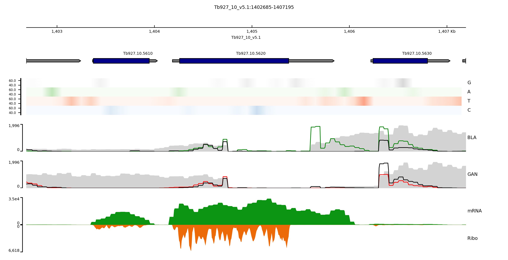

# Post-transcriptional reprogramming by thousands of mRNA untranslated regions in trypanosomes
we describe the UTR sequences that control gene expression in the context of a constitutively transcribed genome
and conclude that thousands of UTRs post-transcriptionally reprogram gene expression profiles in trypanosomes.

## Code Repository
We deposited and divided in subsection the code used for the data analysis

-  <a href="alignment_code/">alignment_code</a>  
This section contains the scripts to align the fastq files to the reference genome

-  <a href="utilities/">utilities</a>  
This section contains the script to identify the barcoded reads in the BAM files.  
It is used in the scripts in alignment_code.

-  <a href="pca_code/">pca_code</a>  
This section contains the scripts to visualize a PCA on the read counts for the analysed samples  
The scripts are implemented in the make_pca.ipynb notebook

-  <a href="peak_finding_code/">peak_finding_code</a>  
This section contains the scripts to identify the regions in the genome responsible for positive or negative selection.  
The notebook <b>b_sample_analysis.ipynb</b> shows the step used for the analysis of the  
positive fragments, from peak finding to creating the paper table (Paper_Table_Blasticidine.csv).  
This notebook comments on all the steps of the analysis, but for some reason, the GitHub rendering is broken  
I suggest cloning the repo and visualising it on your machine.   
The notebook <b>g_sample_analysis.ipynb</b> shows the step used for the analysis of the  
negative fragments, from peak finding to creating the paper table (Paper_Table_Ganciclovir.csv).  

- <a href="circ0s_code/">circos_code</a>  
This section contains the configuration files and data files to use with Circos.   
circos -conf fig_sense.conf to reproduce the paper figure.

- <a href="make_images_code/">make_images_code</a>  
This section contains the configuration files to plot coverage tracks with pyGenomeTracks.  
The notebook <b>pyGtrackViz.ipynb</b> describes in detail the steps for the visualization.  
Again, the GitHub rendering is broken.  
I suggest cloning the repo and visualising it on your machine.  

- <a href="machine_learning_code/">machine_learning_code</a>  
This section contains the scripts used for machine learning.  
The notebook <b>UTR_5_3.ipynb</b> describes in detail the steps taken from the  
creation of the features to the transcription efficiency model.  
This notebook uses features from the 5' and 3' UTRs. This notebook is better annotated than <b>UTR_3.ipynb</b> 
that uses features from the 3' UTRs only. 

